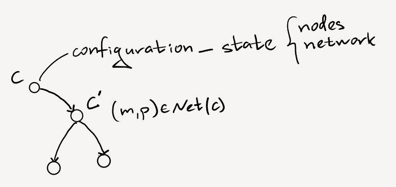
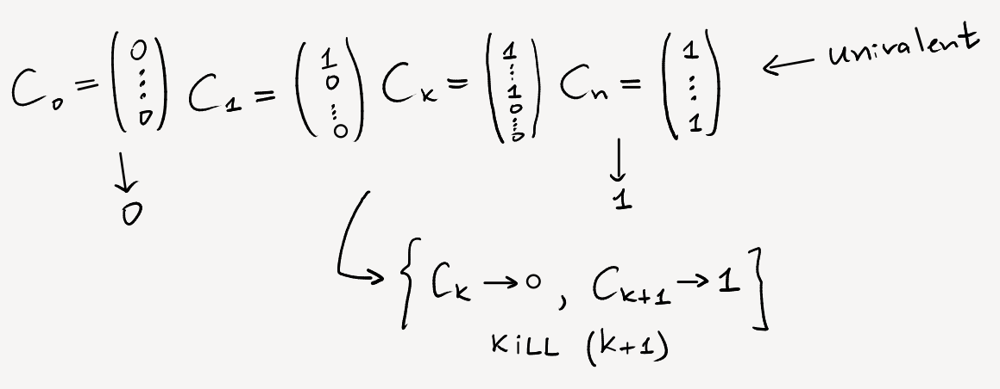
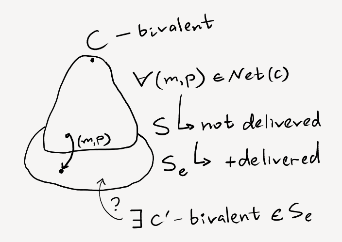
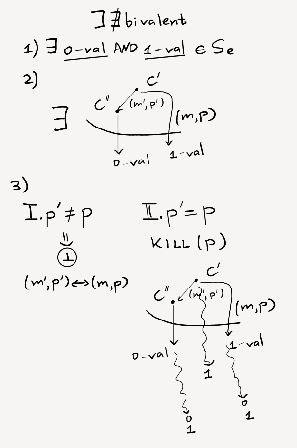

---
---

The [article](https://groups.csail.mit.edu/tds/papers/Lynch/jacm85.pdf)

- Async model
- Deterministic algo
- $f\leq1$

**Binary [[consensus-problem]]:** {0, 1}
- Bivalent: has not chosen 0 or 1
- Univalent: in any continuation will choose 1 or 0

> To prove, that we can travel through only bivalent confighs

#### L1. Bivalent starting configuration exists

#### L2. Bivalent $\longrightarrow$ Bivalent

* So, we **need** assumptions about Time
